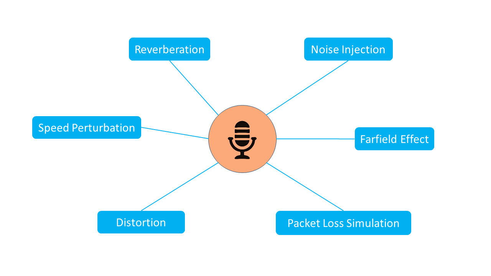

# SpeechAugment

## Motivation
AI algorithms are mostly data-driven, and the quality of the data determines the quality of the model to some extent. This leads to the inherent shortcoming of deep learning, and data augmentation is an effective way to solve this problem.

## Methods
This repo supports audio data augmentations such as :
+ reverberation
+ background noise
+ distortion
+ packet loss simulation
+ farfield effect
+ speed perturbation

After those time domain augmentations, one can apply feature extraction step.

## Installation
To install the released stable version, enter the REPL mode
```julia
] add SpeechAugment
```
or
```julia
Pkg.add("SpeechAugment")
```
To install the development version, enter the REPL mode
````julia
] add https://github.com/sonosole/SpeechAugment.jl.git
```

## Example

```julia
using WAV
using SpeechAugment

# 1. read a wav file as a speech example
batchsize = 8;
data,fs = wavread("/XXPath/ASpeechExample.wav");

# 2. init all the augmentation functions you want
echo  = initAddEcho(fs, (0.05,0.4), (3.0,3.2,2.5,3.5,2.0,3.0));
noise = initAddNoise("XXPathFullOfNoiseWAVs", 2, (5,15));
clip  = initClipWav((0.5,2.0));
drop  = initDropWav(fs, (0.09,0.15));
far   = initFarfieldWav(fs, (0.4,0.9));
speed = initSpeedWav((0.8,1.2));

# 3. make a function list or array
fnlist = [echo noise clip drop far speed];

# 4. augment #batchSize audios
wavs = Vector(undef, batchsize)
for i = 1:batchsize
    wavs[i] = copy(data)
end
wavs = augmentWavs(fnlist, wavs)
for i = 1:batchsize
    wavwrite(wavs[i], "A$i.wav",Fs=16000,nbits=32)
end

# there is also a function called `augmentWav`
# it augments one audio into multiple audios.
audios = augmentWav(fnlist, data, batchsize)
for i = 1:batchsize
    wavwrite(audios[i], "B$i.wav",Fs=16000,nbits=32)
end
```

## Function Parameter Introduction
```julia
initAddEcho(fs::Number, T₆₀Span::NTuple{2,Number}, roomSpan::NTuple{6,Number}) -> addecho(wav::Array)
```
+ `fs` sampling rate
+ `T₆₀Span` effective reverberation time e.g. (minT60, maxT60)
+ `roomSpan` room size e.g. (MinL, MaxL, MinW, MaxW, MinH, MaxH)


```julia
initAddNoise(path::String, period::Int, dBSpan::NTuple{2,Number}) -> addnoise(speech::Array)
```
+ `path` a path only full of noise WAVs
+ `period` every #period it would change another noise wav.
+ `dBSpan` span of SNR e.g. (mindB, maxdB)


```julia
initClipWav(clipSpan::NTuple{2,Number}) -> clipwav(wav::Array)
```
+ `clipSpan` how much it would clip a wav e.g. (0.5,2.0)


```julia
initDropWav(fs::Real, ratioSpan::NTuple{2,Number}) -> dropwav(wav::Array)
```
+ `fs` sampling rate
+ `ratioSpan` span of droping ratio e.g. (0.02, 0.09). 1.0 is the uplimit.


```julia
initFarfieldWav(fs::Real, maxvalueSpan::NTuple{2,Number}) -> farfieldwav(wav::Array)
```
+ `fs` sampling rate
+ `maxvalueSpan` ranges from (0.0,1.0). Smaller means farther away. (0.2, 0.9) is recommended.


```julia
initSpeedWav(speedSpan::NTuple{2,Number}) -> speedwav(wav::Array)
```
+ `speedSpan` range of speed perturbation. (0.85, 1.15) is recommended.


All the `NTuple{2,Number}` parameters should follow the small on the left and the big on the right i.e. (minvalue, maxvalue). To precisely control the extent of augmentation, the below functions could be used:
+ addEcho
+ addNoise
+ clipWav
+ dropWav
+ farfieldWav
+ speedWav

For details, check the documentation or enter the `help?>` mode.
